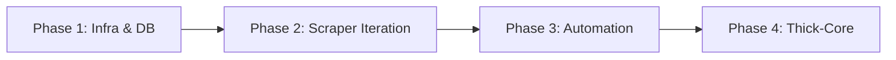

# Kakadu Project Implementation Roadmap

## 1. Executive Summary & Design Constraints

Kakadu is an ultra-lightweight quantitative data collection and indicator calculation engine designed for the Australian Securities Exchange (ASX). This project operates under extreme hardware constraints:

- **Compute**: OCI Micro VM (1GB RAM, Ubuntu 24.04 LTS)
- **Database**: Oracle Autonomous Database (ADB Always Free Tier, EQUITY Schema)

**Core Philosophy**: Thin-Edge, Thick-Core — Python is responsible only for stateless scraping and append-only writing; PL/SQL handles data cleaning, deduplication, and indicator calculations.

---

## 2. Phased Implementation Strategy

### Phase 1: Infrastructure & DB Operator

**Goal**: Establish stable database connectivity, pure-INSERT persistence mechanisms, and local/cloud backup pathways.

- [x] **1.1 Environment Setup**: Configure `.env` environment variables, deploy Oracle mTLS Wallet, and verify python-oracledb Thin Mode connectivity.
- [x] **1.2 ODS Schema Creation**: Execute `install_equity_schema.sql` to establish the EQUITY Schema and `ODS_*` data staging tables with full VARCHAR2 structure.
- [x] **1.3 DbOperator (Append-Only)**: Implement `db_operator.py` using small-batch pure-INSERT commit logic (Batch Size = 5~10).
- [x] **1.4 Backup & Consistency Layer**: Implement local JSON Lines (`.jsonl`) data persistence and OCI Object Storage batch upload module (`UploadManager`).

### Phase 2: Iterative Scraper Development & Regression Test

**Goal**: Develop each data source individually, with full end-to-end regression testing and 1GB RAM stress verification.

- [x] **2.0 Symbol Provider Foundation**: Implement `SymbolProvider` interface to fetch symbols as a generator from `ODS_COMPANY_MASTER`. Verify O(1) memory usage.
- [x] **2.1 Extractor #1: `price_ohlcv`** (Yahoo/ASX API) — Unified OHLCV collection with session handling.
- [x] **2.2 Extractor #2: `afr`** (ASX Quote & Tick API) — Multi-target table writing using centralized `SymbolProvider`.
- [x] **2.3 Extractor #3: `short`** (Shortman API) — Full-market short position history collection.
- [x] **2.4 Extractor #4: `annc`** (ASX Market Announcements — Selenium) — Headless browser scraping with integrated `cleanup_vm.sh`.
- [x] **2.5 Extractor #5: `company_master`** (Ticker Universe — API CSV Export) — Weekly full-market Master data collection.
- [x] **2.6 Extractor #6: `analyst_consensus`** (Yahoo API) — Institutional ratings and targets collection.

### Phase 3: Scheduling, Isolation & Anti-Crash

**Goal**: Achieve unattended automated scheduling, ensuring long-term stable operation without crashes.

#### 3.0 Orchestration Component Development (Certified)

- [x] **3.0.1 Startup Health Probe**: Implement `StartupHealthChecker` to validate Wallet, Env, and DB connectivity before launch.
- [x] **3.0.2 Two-Tier Alerting System**: Implement `AlertManager` for noise-suppressed Pushover notifications.
- [x] **3.0.3 Dynamic Task Dispatcher**: Implement `ScraperFactory` to decouple CLI tasks from class implementations.

#### 3.1 Main Pipeline Integration (Certified)

- [x] **3.1.1 `main.py` & DbTransformer Development**: Integrate HealthCheck → Factory → Scraper → AlertManager → UploadManager → DbTransformer into a single execution flow with 3-tier subcommands (scrape, transform, maintain).
- [x] **3.1.2 Process Shielding & Exit Contracts**: Implement process supervision, exception bubbling, and strict status transition sequences.
- [x] **3.1.3 CLI Interface**: Finalize argparse for subcommands and task routing per ADR-020.

#### 3.2 Production Deployment & Stress Testing

- [ ] **3.2.1 Crontab Event-Driven Schedules**: Configure AEST pre-market (15:25) and post-market (16:45) schedules.
- [ ] **3.2.2 Memory Protection**: Configure 512MB OS Swap space and scheduled weekend physical VM reboot.
- [ ] **3.2.3 Full-Market Truth Test**: Execute full ingestion cycles (~2,000 symbols) and monitor memory peaks via `htop` in the Pre-Prod environment.

### Phase 4: Thick-Core PL/SQL Analytics Engine

**Goal**: Push data cleaning, deduplication, and quantitative indicator calculations entirely to the Oracle database.

- [ ] **4.1 ODS Cleaning & Deduplication Procedures**: Write PL/SQL stored procedures to clean append-only `ODS_*` text data and deduplicate by primary key.
- [ ] **4.2 Technical Indicator Calculation Engine**: Implement PL/SQL incremental calculation procedures for EMA, PSAR, and Supertrend.
- [ ] **4.3 Analytics Views**: Create final signal output views (e.g., `VW_TRADING_SIGNALS`) for direct consumption.

---

## 3. Definition of Done (DoD) & Acceptance Criteria

| Criterion | Description |
|---|---|
| Idempotency & Auditability | Repeating the same batch does not compromise ODS traceability; all data carries `LOAD_TIME` and `BATCH_ID` audit markers. |
| Consistency | Local `.jsonl` backup row count, OCI Object Storage backup row count, and database write row count must be 100% matched. |
| Memory Safety | Throughout the full workflow, VM memory usage remains stable; no OOM crashes are triggered; no residual headless processes remain after Selenium runs. |
| Data Isolation | Pre-market and post-market data can be clearly distinguished by task definitions and target endpoints. |

---

## 4. Known Risks & Safeguards

| Risk | Trigger Scenario | Safeguard & Response |
|---|---|---|
| OOM Crisis | Chrome browser multi-instance or memory not released | Strict single-process operation: automatic `cleanup_vm.sh` (SIGKILL) call at task end. |
| Data Mismatch | Network timeout causing partial data not persisted | Two-tier response: (1) Single batch mismatch → Warning log + backup retained. (2) Cumulative failures → Pushover alert. |
| Lock Contention | High-frequency concurrent writes lock ODS tables | No DB-side MERGE; adopt pure append-only INSERT; deduplication handled by async SP. |
